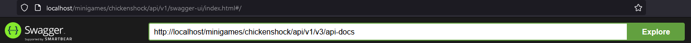
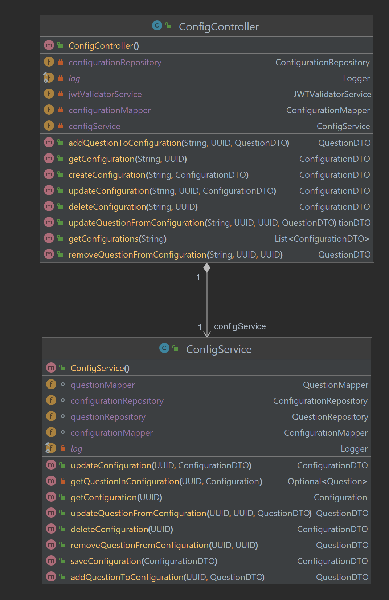
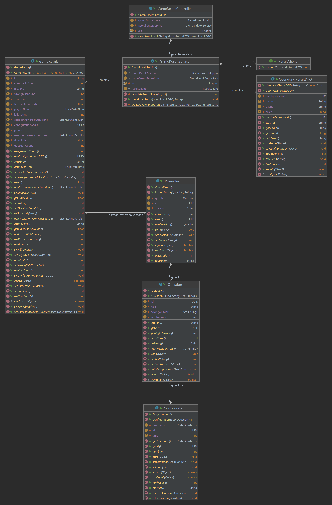

# Chickenshock-Backend

This repository contains the backend for the [Chickenshock minigame](https://gamifyit-docs.readthedocs.io/en/latest/user-manuals/minigames/chickenshock.html).

It persists the game data (configurations, game results, etc.), in a database and communicates with other backend services.

<!-- TOC -->
* [Chickenshock-Backend](#chickenshock-backend)
  * [REST API](#rest-api)
    * [Swagger-Ui (if started)](#swagger-ui--if-started-)
  * [Getting started](#getting-started)
    * [Run](#run)
      * [Docker-compose](#docker-compose)
      * [Project build](#project-build)
      * [With Docker](#with-docker)
    * [Testing Database](#testing-database)
  * [Class Diagrams](#class-diagrams)
<!-- TOC -->

## REST API

Rest mappings are defined
in [`chickenshock-service/src/main/java/com/chickenshockservice/chickenshockservice/controller/ChickenshockController.java`](chickenshock-service/src/main/java/com/chickenshockservice/chickenshockservice/controller/ChickenshockController.java)

### Swagger-Ui

When the service is started (see [Getting started](#getting-started)), you can access the API documentation:

open <http://localhost/minigames/chickenshock/api/v1/swagger-ui/index.html#/> and
fill `http://localhost/minigames/chickenshock/api/v1/v3/api-docs` into the input field in the navbar.


## Getting started

Make sure you have the following installed:

- Java: [JDK 17](https://www.oracle.com/java/technologies/javase/jdk17-archive-downloads.html) or higher
- Maven: [Maven 3.6.3](https://maven.apache.org/download.cgi)
- Docker: [Docker latest or higher](https://www.docker.com/)

First you have to change the spring.datasource.username and the spring.datasource.password in the application.properties
file. If you changed the properties of the postgres db, you also have to change spring.datasource.url.

### Run

#### Docker-compose

Start all dependencies with our docker-compose files.
Check
the [manual for starting the dependencies with docker-compose](https://github.com/Gamify-IT/docs/blob/main/dev-manuals/languages/docker/docker-compose.md)
.

#### Project build

```sh
mvn install
```

in the folder of the project.
Go to the target folder and run

```sh
java -jar chickenshock-service-0.0.1-SNAPSHOT.jar
```

#### With Docker

Build the Docker container with

```sh
docker build  -t chickenshock-backend-dev .
```

And run it at port 8000 with

```
docker run -d -p 8000:80 -e POSTGRES_URL="postgresql://host.docker.internal:5432/postgres" -e POSTGRES_USER="postgres" -e POSTGRES_PASSWORD="postgres" --name chickenshock-backend-dev chickenshock-backend-dev
```

To monitor, stop and remove the container you can use the following commands:

```sh
docker ps -a -f name=chickenshock-backend-dev
```

```sh
docker stop chickenshock-backend-dev
```

```sh
docker rm chickenshock-backend-dev
```

To run the prebuild container use

```sh
docker run -d -p 8000:80 -e POSTGRES_URL="postgresql://host.docker.internal:5432/postgres" -e POSTGRES_USER="postgres" -e POSTGRES_PASSWORD="postgres" --name chickenshock-backend ghcr.io/gamify-it/chickenshock-backend:latest
```

### Testing Database

to setup a database with docker for testing you can use

```sh
docker run -d -p 5432:5432 -e POSTGRES_USER=postgres -e POSTGRES_PASSWORD=postgres -e POSTGRES_DB=postgres  --rm --name chickenshock-database postgres
```

To stop and remove it simply type

```sh
docker stop chickenshock-database
```

## Class Diagrams



