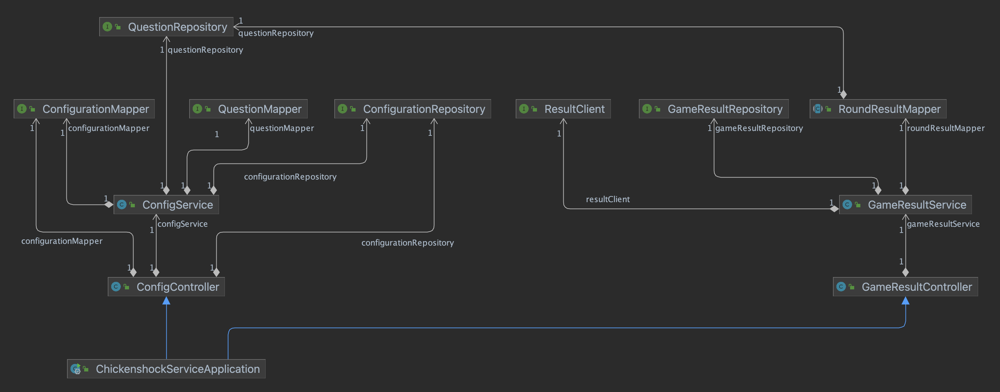

# Chickenshock-Backend

This repository contains the backend for
the [Chickenshock minigame](https://gamifyit-docs.readthedocs.io/en/latest/user-manuals/minigames/chickenshock.html).

It persists the game data (configurations, game results, etc.), in a database and communicates with other backend
services.

## Table of contents

<!-- TOC -->
* [Links](#links)
* [REST API](#rest-api)
  * [Swagger-Ui](#swagger-ui)
* [Getting started](#getting-started)
  * [Run](#run)
    * [Docker-compose](#docker-compose)
    * [Project build](#project-build)
    * [With Docker](#with-docker)
  * [Testing Database](#testing-database)
* [Class Diagrams](#class-diagrams)
  * [ConfigController](#configcontroller)
  * [GameResultController](#gameresultcontroller)
  * [Overview complete application](#overview-complete-application)
* [Constants](#constants)
<!-- TOC -->

## Links

- User documentation for the minigame can be
  found [here](https://gamifyit-docs.readthedocs.io/en/latest/user-manuals/minigames/chickenshock.html).
- For the frontend, see the [Gamify-IT/chickenshock repository](https://github.com/Gamify-IT/chickenshock).
- The installation manual and setup instructions can be
  found [here](https://gamifyit-docs.readthedocs.io/en/latest/install-manuals/index.html).

## REST API

Rest mappings are defined in

- Game result
  controller: [`src/main/java/de/unistuttgart/chickenshockbackend/controller/GameResultController.java`](src/main/java/de/unistuttgart/chickenshockbackend/controller/GameResultController.java)
- Config
  controller: [`src/main/java/de/unistuttgart/chickenshockbackend/controller/ConfigController.java`](src/main/java/de/unistuttgart/chickenshockbackend/controller/ConfigController.java)

### Swagger-Ui

When the service is started (see [Getting started](#getting-started)), you can access the API documentation:

Open <http://localhost/minigames/chickenshock/api/v1/swagger-ui/index.html#/> and
fill `http://localhost/minigames/chickenshock/api/v1/v3/api-docs` into the input field in the navbar.


# Development

## Getting started
> Beginning of additions (that work)

Make sure you have the following installed:

- Java: [JDK 1.17](https://www.oracle.com/java/technologies/javase/jdk17-archive-downloads.html) or higher
- Maven: [Maven 3.6.3](https://maven.apache.org/download.cgi)
- Docker: [Docker](https://www.docker.com/)
- PostgreSQL: [PostgreSQL](https://www.postgresql.org/download/)

### Run
### Project build
To build the project, run:

```sh
mvn install
```

in the project folder.
Then go to the target folder:
```sh
cd target
```
and run:
```sh
java -jar chickenshock-backend-0.0.1-SNAPSHOT.jar
```
to start the application.


### Build with docker
To run your local changes as a docker container, with all necessary dependencies,
build the Docker container with:

```sh
docker compose up --build
```
You can remove the containers with:
```sh
docker compose down
```

### Run local with dependencies
To run your local build within your IDE, but also have the dependencies running in docker, follow the steps
to build the project, then run the dependencies in docker with the following:
```sh
docker compose -f docker-compose-dev.yaml up 
```
You can remove the containers with:
```sh
docker compose -f docker-compose-dev.yaml down
```

> End of additions


### Testing Database

To set up a database with docker for testing you can use

```sh
docker run -d -p 5432:5432 -e POSTGRES_USER=postgres -e POSTGRES_PASSWORD=postgres -e POSTGRES_DB=postgres  --rm --name chickenshock-database postgres
```

To stop and remove it simply type

```sh
docker stop chickenshock-database
```

## Class Diagrams

### ConfigController

This class diagram shows an overview of the ConfigController class.

### GameResultController

This class diagram shows an overview of the GameResultController class.
The data structure of `GameResult` and its contents are shown at the left and bottom of the diagram.

### Overview complete application

This simplified class diagram shows how the most important services, mappers and repositories in the project are interlinked.

## Constants

To prevent incorrect or cheated data, all important values are checked for logic.
The field borders are configured in `src/main/java/de/unistuttgart/chickenshockbackend/Constants.java`.

1. `MIN_POINTS`: minimal number of points a player can achieve
2. `MAX_POINTS`: maximal number of points a player can achieve
3. `MIN_QUESTION_COUNT` minimal number of questions a player can answer correctly
4. `MAX_QUESTION_COUNT` maximal number of questions a player can answer correctly
5. `MIN_TIME` and `MIN/MAX_SCORE` should not be changed